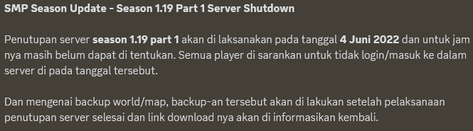
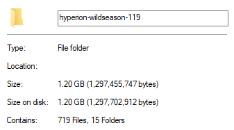
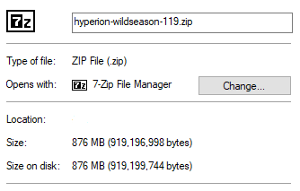

## Season Information
This is **Season 1.19 - Part 1**. We apologize, but we forgot when that season was held on. We only remember the year, the season was held on 2022.
And the season has ended on **June 4th, 2022**. 

The image below was the announcement when the season will be ended. The announcement was sent in Bahasa Indonesia, because the majority of players are from Indonesia.

## World Information
When the season launched, the world dimension was completely separated, which means Overworld, Nether and also The End world folder was not in the same folder.
It happens because the software we used. We used [Paper](https://papermc.io) software. We merged the whole world dimension into one folder, so you can play it on Single-player mode. If the world dimension wasn't merged into one folder, you can't play it on Single-player mode. 

The world file size is about **1.20 GB (Gigabytes)** when unzipped.

When download, you only download about **800 MB (Megabytes)**, because it is a compressed file (.zip).

## Download Link
You can download the world (hyperion-wildseason-119.zip) from our [cloud storage](https://1drv.ms/u/s!AijIqc_DUK1ugUo1LOlRx-8KRnks?e=7fxb5V). The cloud storage we used is serviced by [Microsoft](https://www.microsoft.com/), **Microsoft OneDrive**.