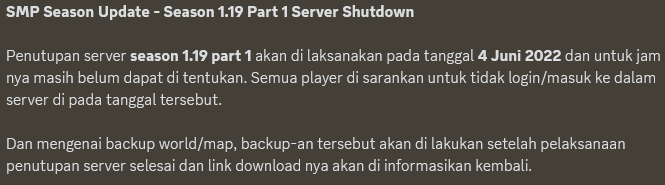
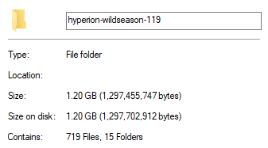
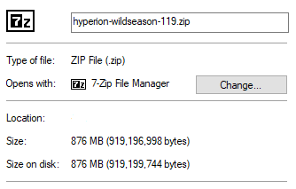

## Informasi Musim/Season
Ini adalah **Season 1.19 - Part 1**. Kami mohon maaf, tapi kami lupa kapan musim/season ini diadakan. Kami hanya mengingat tahunnya saja, musim/season diadakan pada tahun 2022.
Dan musim/season ini telah berakhir pada **4 Juni 2022**.

Gambar di bawah adalah pengumuman kapan musim/season akan berakhir.

## Informasi Dunia
Saat musim/season diluncurkan, dimensi dunia benar-benar terpisah, yang berarti folder Overworld, Nether dan juga The End tidak berada di dalam folder yang sama.
Hal ini terjadi karena perangkat lunak/software yang kami gunakan. Kami menggunakan software [Paper](https://papermc.io). 
Kami telah menggabungkan seluruh dimensi dunia menjadi satu folder, sehingga Anda dapat memainkannya dalam mode Single-player. Jika dimensi dunia tidak digabungkan menjadi satu folder, Anda tidak dapat memainkannya dalam mode Single-player.

Ukuran file dunia adalah sekitar **1,20 GB (Gigabytes)** setelah di ekstrak.

Saat mengunduh, Anda hanya mengunduh sekitar **800 MB (Megabytes)**, karena file sudah terkompresi (.zip).

## Tautan Unduhan
Anda dapat mengunduh dunia (hyperion-wildseason-119.zip) dari [penyimpanan cloud](https://1drv.ms/u/s!AijIqc_DUK1ugUo1LOlRx-8KRnks?e=7fxb5V) kami. Penyimpanan cloud yang kami gunakan dilayani oleh [Microsoft](https://www.microsoft.com/), **Microsoft OneDrive**.